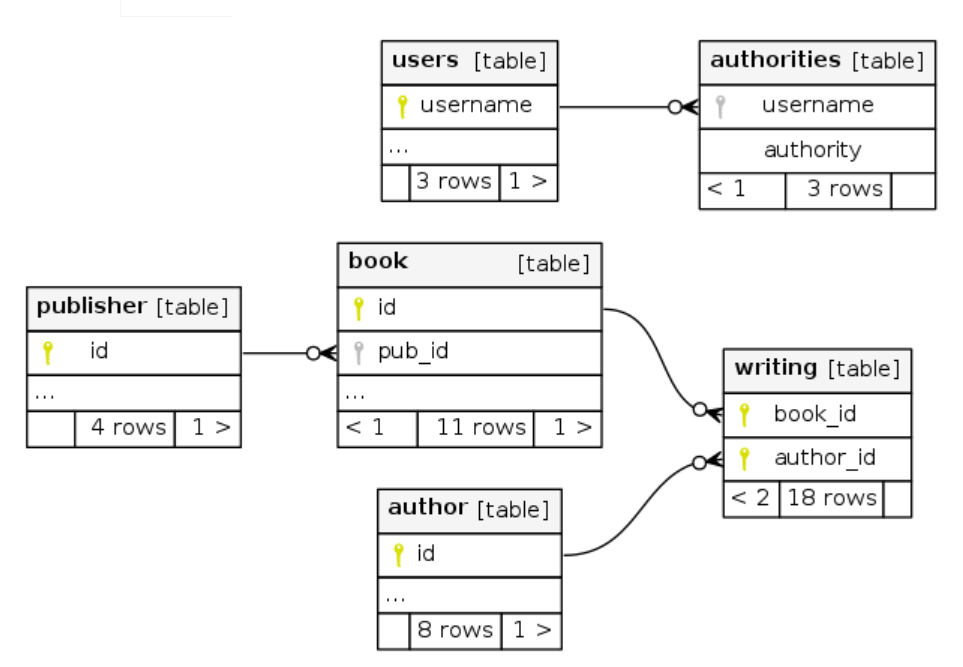
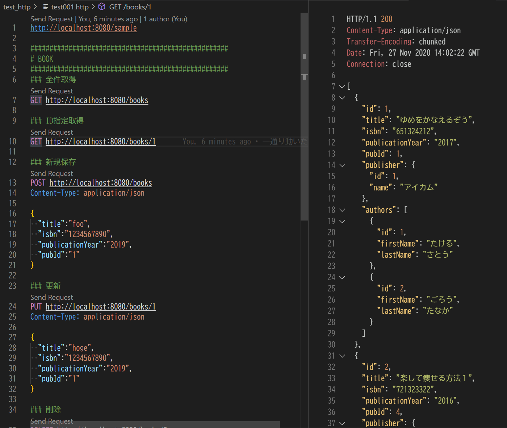

# Springboot + maven のAPIサンプル

BookオブジェクトのAPIサンプル



※用意したAPIはBookのCRUDだけ

## 起動方法

```sh
$ mvn spring-boot:run

または

$ bash mvnw spring-boot:run
```

## 構成

DB : H2DB

### 接続情報

src\main\resources\application.properties

```properties
# H2をインメモリモードで利用する
spring.datasource.driverClassName=org.h2.Driver
spring.datasource.url=jdbc:h2:mem:test;MODE=MySQL
spring.datasource.username=sa
spring.datasource.password:

# H2のコンソール使用を許可
spring.h2.console.enabled=true
# http://localhost:8080/h2-console
```

### 初期化情報

src\main\resources\db\migration

src\main\resources\dev\migration

## 動作確認

HTTPコマンド一覧

test_http\test001.http

vscode + REST Client拡張を入れると実行可能


